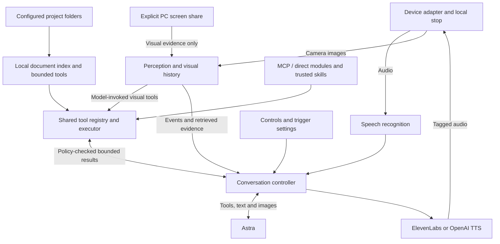
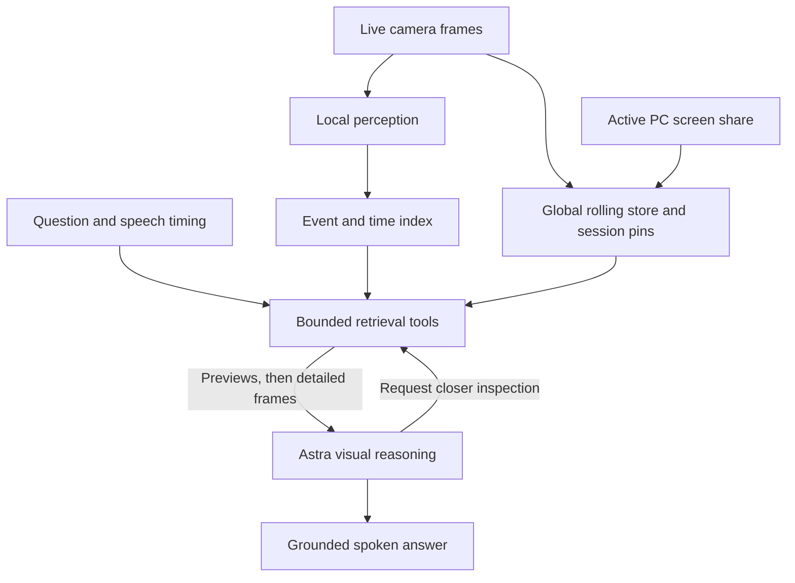

# Iago - Reachy Mini Brain

Full feature list, architecture, and Codex build specification for Rafael

**Revision 6 - 11 September 2026 - amended first-release planning specification**

This document replaces the earlier architecture drafts. It incorporates PC testing, Astra reasoning, ElevenLabs voice, whiteboard and phone understanding, a rolling visual history, object/person detection, wave recognition, configurable spontaneous responses, and optional PC offloading over Wi-Fi.

**Review stage only. No application has been built or tested.** Implementation starts after Rafael reviews the scope. API choices are grounded in the linked official documentation; performance figures and tuning values are proposed targets, not measured results. Codex must verify the installed SDKs, model access, and actual hardware when building.

Revision 6 preserves all 35 Revision 5 features, including P10, V9 and K1, and adds E1: 36 features total (C1-C9, V1-V9, P1-P10, D1-D6, K1 and E1). This amendment updates planning only; implementation and acceptance validation remain unstarted.

Wake-word detection is outside this release. Keep existing Start conversation controls and visual triggers. If wake-word support is added later, the selected word is "Iago", named after the Aladdin parrot. This records a future choice, not a detector to implement.

## 1. The product we are building

A real-world visual companion and think-out-loud partner. Rafael can show it a whiteboard, phone, sketch, or object; discuss what is visible; refer back to something shown earlier; and interrupt it naturally. It can later initiate a short interaction when a configured visual event occurs, such as someone entering its view or waving hello.

The first usable delivery runs on Rafael's Windows PC using the actual webcam, microphone, and speakers. After Reachy arrives, the same conversation application can use the robot's sensors and actuators while heavier processing stays on the PC. A standalone robot profile remains available for the features and processing rates that its onboard computer can sustain.

The design has three distinct loops: fast local perception, a bounded visual-history store, and on-demand Astra reasoning. Camera frame rate, detection frame rate, archive frame rate, and cloud reasoning frequency are independently controlled. Recording one image per second does not limit wave detection to one frame per second.

### Settled requirements

- Brain: Astra (`gpt-6-astra`), initially using low reasoning effort for spoken interaction.
- Voice: ElevenLabs with Rafael's chosen voice when key and voice ID validate; OpenAI TTS as the default/fallback.
- Conversation: streaming transcription, streamed Astra text, and separate streaming speech synthesis; listening continues during speech.
- Vision: simultaneous camera and continuous desktop screen sharing, detailed whiteboard/phone/screen inspection, and source-aware retrieval within shared budgets.
- Project knowledge: read-only local indexing and bounded cited retrieval from configured project folders.
- Perception: person/object presence, temporal waves, context-bound thumbs-up/down yes/no responses, timestamped events, and configurable event-to-prompt rules.
- Deployment: PC-only first; PC-assisted Reachy supported; standalone Reachy qualified separately.
- Control: visible camera/listening state, immediate Stop, optional awareness and spontaneous speech, and bounded storage and API use.

### What the experience should feel like

You show a diagram on your phone, put it down, and ask how it could improve a game mechanic. The bot retrieves the relevant image, inspects the diagram, and discusses it. You interrupt halfway through an answer, change something on the whiteboard, and continue. When an enabled greeting rule sees you wave, it can acknowledge you and begin a conversation without a spoken wake command.

The camera does not need to narrate the room continuously. Visual observations inform the conversation and trigger only the behaviors you configure. Detection indicates a visible person or supported object; it does not establish a person's identity or perfectly understand every gesture.

## 2. Full feature list and release scope

“First release” means implementation is required in the initial Codex assignment. Before hardware delivery, PC checks can pass and physical robot checks must be reported as pending. “Later” items are extension points, not hidden requirements for completing this release.

### Conversation and voice

| ID / feature | First-release behavior | Verification |
| --- | --- | --- |
| C1. Spoken brainstorming | Live transcription to Astra; concise responses that develop ideas and notice tradeoffs | Real discussion with pauses and changes of mind |
| C2. Full-duplex interruption | Speak over the assistant or press Stop; queued text/audio is canceled | Both voice providers; physical speaker cutoff |
| C3. Patient turns | Normal and Patient endpoint settings; manual talk/commit fallback | Unfinished thoughts do not routinely trigger early replies |
| C4. Astra brain | Text/image reasoning and bounded visual retrieval tools | Real model access; brain unchanged during voice fallback |
| C5. ElevenLabs voice | Chosen voice ID, preview, validation, streaming output | Actual configured voice plays |
| C6. OpenAI speech | Works alone; fallback follows explicit policy | Missing key, provider failure, and interrupted fallback |
| C7. Personality | Editable instructions; English default and explicit language switching | Short useful spoken turns; respectful challenge |
| C8. Conversation continuity | Active context, heard-answer history, bounded summaries | Interrupted answers do not introduce unheard facts |
| C9. Notes and history | Optional saved transcripts, explicit Save idea, export/delete | No external development actions from casual discussion |

### Vision and visual memory

| ID / feature | First-release behavior | Verification |
| --- | --- | --- |
| V1. Live view | Webcam/robot preview, current frame, camera controls | Fresh image IDs and visible capture state |
| V2. Whiteboard and phone reading | Detailed source images, selectable crops, overview plus detail; ask for a better view when needed | Real handwriting, diagrams, and phone screens |
| V3. Visual ring buffer | Approximately ten minutes at 1 fps, bounded by bytes too | Time/size eviction and visible retained range |
| V4. Visual history tools | Browse timeline, search metadata, inspect original frame/crop, capture now | References to earlier objects resolve to actual evidence |
| V5. Speech/image alignment | Capture timestamps linked to spoken turns and events | Object shown during a question remains findable after being lowered |
| V6. Session reference images | Explicitly pin a small set of boards/images; version changed boards | Discussion can outlast ten-minute rolling history |
| V7. Image input fallback | Upload or paste a screenshot/photo on the PC | Read detailed material when optical capture is poor |
| V8. Evidence display | Show the images/times used for the answer and uncertainty | User can correct the selected reference |
| V9. Continuous desktop screen sharing | Explicit browser sharing alongside camera; current/detail/history/pins with source labels and global budgets | Real screen questions, source attribution, clearing, capture lifecycle and interruption |

### Perception and initiative

| ID / feature | First-release behavior | Verification |
| --- | --- | --- |
| P1. Person presence | Stable presence/absence and entry/exit events | Occlusion does not repeatedly produce greetings |
| P2. Object detection | Small pretrained detector; supported labels, boxes, scores | Labels are declared; unknown objects remain available to Astra vision |
| P3. Wave detection | Hand landmarks across time plus a wave state machine | Static open palm, drawing and robot camera motion are negative cases |
| P4. Event log | Timestamped presence, wave, supported object-appearance, and scene-change events | Events link to retained frames where available |
| P5. Trigger rules | Editable prompt, enable toggle, conditions, cooldown, expiry and action | Deterministic suppression and cancellation tests |
| P6. Greeting presets | Working person-entry and wave presets; initially disabled during setup | Enabled presets can start a short conversation |
| P7. Aware mode | Local perception outside a conversation; explicit active state | No continuous cloud reasoning or transcription while merely aware |
| P8. Restraint | User speech wins; repeat suppression, quiet times and interruption backoff | No event storm or stale greetings |
| P9. Physical expression | Small acknowledgment/listening/speaking cues; motion off switch | SDK bounds and single motion owner; PC uses a state indicator |
| P10. Thumbs-up / thumbs-down conversational responses | Local live-camera yes/no input bound to an active question; stable detection, release rearming and speech arbitration | Real thumb examples; deterministic conflicts, expiry, held gestures and forbidden-source tests |

### Deployment and controls

| ID / feature | First-release behavior | Verification |
| --- | --- | --- |
| D1. PC-only mode | Native Windows backend plus local browser devices | No Reachy, simulator, WSL or robot media stack needed |
| D2. PC-assisted Reachy | Robot handles physical media and stop; PC handles brain orchestration, history and perception | Fake edge integration now; real Wi-Fi acceptance after arrival |
| D3. Standalone profile | Same core can run onboard with qualified reduced workloads | Hardware performance report; full-rate vision is not assumed |
| D4. Control UI | Session/mode controls, devices, voice, vision, history, triggers and diagnostics | Clear setup and active state |
| D5. Recovery | Bounded queues, reconnect, device-loss handling, local watchdog | No stale audio/events replay after recovery |
| D6. Diagnostics and budget | Stage latency, effective fps, resource use, storage and provider usage | Actual values distinguished from estimates |

### Project knowledge

| ID / feature | First-release behavior | Verification |
| --- | --- | --- |
| K1. Search project documents during conversation | Configured project folders, local incremental read-only index, bounded Astra search/read tools and cited snippets | Known passages, paraphrases, absent answers, updates/deletions, project isolation, exclusions and cancellation |

### Extensible integrations and workflows

| ID / feature | First-release behavior | Verification |
| --- | --- | --- |
| E1. Extensible tools, integrations and skills | Working shared registry/executor, MCP/direct adapters, private credentials, trusted skills, action policies, exact confirmations, durable reconciliation, event ingress and controls | Actual transport round trips with a test-only fake calendar and sample workflow; policy/race checks and interruption under integration load |

### Explicit later extensions

Production calendar, email and WhatsApp connectors, provider-specific OAuth setup screens, email webhooks, calendar scheduling services and background notification services remain future work. E1 infrastructure and its test-only calendar/workflow demonstration are required in V1; they do not establish production connector functionality.

Named-person recognition, gestures beyond required waves and thumb responses, dense action understanding, semantic image embeddings, document OCR, unrestricted enterprise-scale knowledge search, persistent visual memory across days, local speech/LLM inference, custom model training, wake-word detection, autonomous coding/backlog execution, and automatic distributed failover are later work. Those later extensions are not required for this release. Continuous desktop screen sharing and bounded project-document retrieval are required first-release features. General eye/head tracking can be added after basic motion and camera-motion suppression are stable.

## 3. Deployment modes and hardware

| Mode | Physical devices and local stop | Application, history and perception |
| --- | --- | --- |
| `desktop` | PC browser uses webcam, microphone and speakers | Python backend on the PC; no robot dependencies |
| `reachy_pc` | Reachy daemon plus a small edge service own physical I/O and immediate stop | Python backend and vision workers on PC over the local network |
| `reachy_local` | Reachy daemon and local edge components | Backend/history onboard; perception rate and storage budget qualified on hardware |
| `fake` / optional simulation | Deterministic fake I/O, or simulated movement | Same core with fake providers or real services as chosen |

The normal development path is desktop first, then PC-assisted Reachy. This is a recommendation based on the growing vision workload, not a requirement to keep the PC involved forever. Switching profiles is an explicit restart/reconnect at a quiet boundary; it must not run two controllers against one speaker or robot.

Astra, transcription and voice generation remain cloud services in all three real profiles. Offloading means moving local perception, storage and orchestration to the PC; it does not install Astra or ElevenLabs inference on the PC. A GPU is not a prerequisite for the first lightweight detectors.

Reachy Wireless currently includes a CM4 with 4 GB RAM and 16 GB flash, camera, microphones, speaker, Wi-Fi, battery, and movement hardware. The XMOS audio path supplies echo processing. Confirm the shipped revision and selected processed microphone path on arrival. [Hardware](https://huggingface.co/docs/reachy_mini/platforms/reachy_mini/hardware), [Advanced media controls](https://huggingface.co/docs/reachy_mini/platforms/reachy_mini/media_advanced_controls)

### Added input availability by deployment mode

| Mode | P10 live gestures | V9 PC screen | K1 project documents |
| --- | --- | --- | --- |
| desktop | Selected live PC webcam | Active PC Chrome/Edge sharing session | Configured folders accessible to the PC backend |
| reachy_pc | Selected live Reachy camera through existing hand pipeline | Active PC browser sharing session alongside robot camera | Configured PC folders |
| reachy_local | Live Reachy camera; rates qualified onboard | No PC screen when PC is off; requires an explicitly connected, authenticated PC sharing session, otherwise unavailable | Only configured robot-accessible folders, including an explicitly configured mounted/copied source; no implicit PC folder access |
| fake | Declared synthetic/prerecorded tests only | Fake capture for offline contracts | Isolated fixture projects only |

In robot modes the PC browser uses an authenticated visual-ingest/control connection with browser-compatible secure access configured during the build; it must not open another mic/speaker route. Loss of a screen-sharing page clears its screen source while an independently owned conversation continues. Loss of the desktop page that also owns physical audio still follows the original stop/end watchdog rule; losing a separate sharing page must not end an otherwise usable desktop or robot conversation. Verify actual browser/deployment capabilities and document prerequisites. No PC-screen feature is claimed when the PC is switched off.

### Required setup

Use Rafael's existing PC webcam, microphone and speakers; a current Chrome or Edge browser; Python and a package manager such as `uv`; an OpenAI API project with model access and billing; the existing ElevenLabs key and chosen voice ID; a source repository; and the Reachy hardware when available. Begin with Python 3.12 if the selected dependency versions support it. Record versions and lock dependencies during implementation.

PC-assisted operation needs the PC awake and the devices mutually reachable on the LAN. A shared Wi-Fi name alone does not prove connectivity if guest/client isolation is enabled. Pair the machines and test reachability in setup. A wired PC connection to the same router is also compatible; it is optional.

## 4. Architecture and ownership

Use one Python application package with clear modules. The PC-assisted profile adds an edge process on Reachy and an authenticated transport; it does not require a custom cloud server. Run perception in bounded worker tasks/processes so inference cannot block audio callbacks or the conversation controller.



The device adapter always lives next to the physical sink: browser on PC, edge service on Reachy. It is authoritative for immediate playback invalidation and observed playback position. The conversation controller owns turn ordering, reasoning, trigger arbitration, and the next answer. The two exchange session/connection IDs, answer epochs and stop acknowledgments.

Visual metadata is evidence, not an instruction channel. Text seen on a board, phone or image cannot change tool permissions, enable triggers, expose secrets or launch external actions. Treat it as content to discuss unless Rafael explicitly asks for an action supported by the app.

The controller additionally owns active yes/no question IDs, atomic speech/gesture arbitration, visual source generations and active-project generations. Document indexing runs in bounded local workers separate from perception and audio. Screen input feeds visual history/retrieval only, never hand/gesture or proactive camera-event pipelines. Project text is evidence and cannot grant permissions.

### Upstream integration

Reuse the official Reachy conversation template's compatible app lifecycle and hardware plumbing. The required Astra/STT/TTS separation, visual tools and event rules are application code; changing a backend URL in a template does not provide them. Keep desktop imports independent of Reachy and GStreamer. [Official conversation app](https://github.com/pollen-robotics/reachy_mini_conversation_app), [App lifecycle](https://huggingface.co/docs/reachy_mini/SDK/apps)

The current Reachy media architecture exposes local IPC/GStreamer paths and remote WebRTC media. Its documented local camera IPC path is capped at 10 fps; do not promise a 15-fps onboard detector from that path. The off-robot consumer can use aiortc. Some supported remote connection paths use Hugging Face signaling/authentication even when media is peer-to-peer. Record the chosen path's actual setup dependencies. [Media architecture](https://huggingface.co/docs/reachy_mini/SDK/media-architecture), [Off-robot consumer](https://huggingface.co/docs/reachy_mini/SDK/cloud-backend-consumer)

## 5. Speech, Astra, and voice selection

Astra supports text and image inputs with streamed text output; its listed modalities exclude direct audio and video. The primary pipeline is microphone -> transcription -> Astra -> selected TTS -> speaker. Selected frames and visual tool results accompany the text. [Astra model](https://developers.openai.com/api/docs/models/gpt-6-astra)

| Stage | Initial implementation | Policy |
| --- | --- | --- |
| Recognition | OpenAI realtime transcription, initially `gpt-live-transcribe` | Verify access/schema; app owns turn commits |
| Brain | `gpt-6-astra` through Responses, reasoning effort `low` | Same model for conversation and visual reasoning |
| Preferred voice | ElevenLabs, chosen voice ID; initially `eleven_flash_v2_5` | Auto-select after key/voice/model/format validation |
| Default/fallback voice | OpenAI `gpt-4o-mini-tts`; initial voice `coral` | Used if ElevenLabs is absent or under bounded fallback policy |

The named models are build defaults to verify against current APIs and actual account access. ElevenLabs' streaming guide recommends Flash v2.5 for latency and excludes v3 from that particular streaming-input endpoint. Preserve the chosen voice; do not silently substitute another ElevenLabs voice. [Realtime transcription](https://developers.openai.com/api/docs/guides/realtime-transcription), [OpenAI TTS](https://developers.openai.com/api/docs/guides/text-to-speech), [ElevenLabs streaming](https://elevenlabs.io/docs/eleven-api/guides/how-to/websockets/realtime-tts)

### Voice selection and failure

`TTS_PROVIDER=auto` selects ElevenLabs only when its key, chosen voice ID, compatible model and format validate. With only OpenAI configured, the complete app works using OpenAI speech. A key without a voice ID leaves OpenAI active and displays the missing setting. Explicit `openai` and `elevenlabs` overrides support testing; an explicit ElevenLabs override reports invalid configuration instead of silently switching.

If selected speech fails before any sound is heard, allow one bounded OpenAI fallback attempt for the same text and valid epoch. If some speech was already heard, stop, record the interruption, and use the fallback on the next turn or an explicit Resume request. Never automatically replay a partly heard answer from its beginning. User interruption cancels any fallback attempt too.

Pin provider and voice for each utterance. Use a circuit breaker after repeated failures, show the active provider/fallback reason, and switch at quiet boundaries. If both services fail, show the answer as text with a speech error. ElevenLabs supplies speech only; its hosted agent platform is not the conversation owner.

### Turn taking and streaming

1. Read processed microphone audio continuously during a conversation, including during playback. Normalize once to the recognition service format, initially mono PCM16 at 24 kHz after verifying the endpoint.
2. Run local voice activity detection (VAD) and stream audio to recognition. Keep a small pre-roll to preserve the beginning of speech; do not monitor microphone input through the speaker.
3. Correlate partial and final transcripts by input item ID. Final completions can arrive out of order. Commit only through the authoritative local turn controller.
4. Start with approximately 700 ms of silence in Normal mode and 1,200 ms in Patient mode. Continued speech cancels a pending answer and merges the continuation in capture order. Manual talk/commit remains available.
5. Use final text, heard conversation history and the selected visual context to ask Astra. If evidence is needed, complete the bounded retrieval loop before speaking factual visual conclusions.
6. Stream short, coherent sentences or clauses to TTS. Do not wait for the whole answer and do not synthesize each token individually. Only user-facing answer text enters TTS.

Astra's streaming events, provider receive tasks, text segmentation, synthesis, playback, UI, and vision run independently. Reasoning items, tool arguments, debug messages and intermediate visual hypotheses never enter the speech queue. [Responses streaming](https://developers.openai.com/api/docs/guides/streaming-responses)

OpenAI TTS receives completed text segments per request and streams their audio. ElevenLabs accepts incremental text; use an utterance/context ID tied to the answer epoch. Its `flush: true` means generate buffered text, not discard it. Prefer a supported PCM format and verified sample rate; include decoding latency when compressed output is necessary. Alignment metadata is usable only after validation against actual playback. [ElevenLabs context API](https://elevenlabs.io/docs/api-reference/text-to-speech/v-1-text-to-speech-voice-id-multi-stream-input)

## 6. Interruption and correct conversation history

Interruption is a device-side action first. It must not wait for transcription, Astra, TTS cancellation, a visual tool, or the PC network round trip when the robot can detect speech locally.

### Immediate stop sequence

1. The physical device adapter detects confirmed speech onset or receives Stop. It invalidates the active playback authorization, clears its queue/decoder/device sink as supported, stops speech-driven motion and emits a local stop event.
2. The controller advances the answer epoch and invalidates every child task: Astra generation, visual/document retrieval, pending gesture responses, text segmentation, TTS, fallback and queued event responses.
3. Request supported provider cancellation or detach the stream. Local filtering rejects all late chunks regardless of provider acknowledgment; closing a stream is not proof that provider billing stopped.
4. Record a conservative played position, repair the heard-history ledger, and continue microphone capture for the new turn.
5. Admit a fresh answer only after cancellation/history reconciliation and a new sink authorization.

On desktop, the Stop button silences the browser renderer immediately and then notifies Python; spoken interruption comes from the local PC VAD path. On Reachy, VAD and the playback guard run on the robot even in PC-assisted mode. A local stop latches until the controller has reconciled the event, preventing an old in-flight packet from restarting speech.

Tag every output with session ID, connection generation, answer epoch, utterance ID, segment ID and sequence. Reconnection starts with a new connection generation. Cancellation is idempotent, and an older epoch can never regain output ownership. A local watchdog stops speech/motion when the controller lease expires.

### What Astra may remember

Track generated text, synthesized audio and heard text separately. Determine heard position from sink timing plus a conservative allowance for device latency. Received/enqueued bytes and worklet-consumed samples are not necessarily audible samples. Map positions through resampling. Use verified alignment for finer text prefixes; otherwise retain only completely played segments and mark the next as interrupted.

Keep application-owned canonical conversation history. Send curated input with `store=false` in the proposed Responses design; do not chain through an old full response that contains unheard text. Realtime audio-item truncation is not the repair mechanism for Astra Responses. [Conversation state](https://developers.openai.com/api/docs/guides/conversation-state)

Within an active visual tool loop, preserve required tool call/result pairs and any reasoning items required by the API. After cancellation, rebuild the next turn from canonical heard conversation and retained factual evidence; do not reintroduce the canceled answer through an opaque prior-response chain. An interrupted retrieval may populate a still-valid local cache, but cannot speak or pin evidence on its own.

Test interruption while waiting for a transcript, retrieving frames, receiving Astra text, synthesizing, playing, and starting a fallback. Test old audio arriving after a newer turn, simultaneous Stop/VAD, and PC loss during robot playback. A cleared Python queue alone never proves physical silence.

## 7. Camera/screen capture and the rolling visual history

The history is a local rolling image store, not a continuous video recording and not an automatic stream of cloud model calls. Visual capture is enabled only in Aware or Conversation mode with each source explicitly enabled: camera on and/or an active user-started screen share. The app can retain an image before Astra has ever inspected it.

| Path | Starting configuration | Purpose |
| --- | --- | --- |
| Camera source | Negotiate an available resolution/frame rate; record actual settings | Feed independent consumers |
| Archive | Around 1 detailed image/sec per enabled live source; 600-second retention | Earlier camera and screen evidence under one global byte cap |
| Presence/object detection | 2-5 fps, small resized input | Fast lightweight observations |
| Hand/wave processing | Target 10 fps initially; PC may test 15 fps | Motion over multiple frames |
| Astra visual input | Fresh view or a few retrieved images per relevant turn | Understanding and conversation |

Rates are tuning targets. Respect the selected camera path's real limit, drop obsolete inference work, and show effective fps. Detection uses resized copies; it must not reduce the only stored source image to detector resolution.

### Frame quality and selection

Keep a current frame ready for “What is this?” and “Look now.” On the PC, start with a source around 1920 pixels across or higher where the camera supports it, and tune against actual phone text and whiteboard writing. Store detailed JPEGs at a quality chosen from measured readability and size. Keep PNG/screenshot originals for explicit uploads when useful. Preserve source dimensions, orientation and transformation metadata.

Prefer a sharp frame after motion settles, while retaining the scheduled sampling floor so a hand-held object is not lost merely because the scene was moving. Scene changes and speech references can nominate a few additional event frames or a short capture burst, within the same byte limit. Repeatedly adding identical frames is unnecessary; deduplication must preserve the observed time interval and cannot hide changes to small writing.

Detailed inspection uses an overview plus selected source-resolution crops. Cropping can make existing text easier to inspect; it cannot recover detail that was never captured. Offer a larger view, closer camera position, reduced glare, or a screenshot upload when the source is unreadable. Astra supports detailed image input, including `original`; model-specific dimension/patch limits still apply. [Vision input and detail](https://developers.openai.com/api/docs/guides/images-vision)

### Storage size and retention

At 1 fps, ten minutes contains 600 images per enabled live source. At an illustrative 150-400 KB per compressed image, image bytes alone would occupy roughly 90-240 MB. This is arithmetic, not a camera benchmark. Detailed images, thumbnails, metadata, burst frames and pins add overhead.

Use one global 512 MiB rolling-store byte cap across camera, screen and upload sources on the PC, together with the 600-second age limit. Evict oldest unpinned frame families whenever either is exceeded. Show the actual earliest retained time; do not promise ten minutes when the byte cap produces a shorter window. Include thumbnails and derived crops in accounting. Cap frame dimensions, individual upload size and in-flight reservations before decoding or writing.

The PC store can use a private application temporary directory plus SQLite metadata. Keep only a few decoded frames and bounded encoded-image caches in RAM. The proposed standalone robot profile starts with a smaller compressed-memory budget, for example 256 MiB, and must be measured with all other workloads. Avoid assuming unlimited RAM or continuously writing a large archive to the robot's flash.

Expire image bytes and searchable records together. Derived crops/previews inherit the source expiry unless explicitly pinned. Purge expired temporary data after crashes/restarts. Brief retrieval leases may protect an in-flight read, but must count against the byte budget and cannot become indefinite retention. Return “expired” if a requested source has gone away.

### Pinned images for the current discussion

Provide “Keep this board” and Unpin. Pin a specific immutable frame/version, with a user-readable label, for the current session. Proposed global limit: 10 images and 64 MiB across all sources in one separate, visibly reported pin budget. Keep the rolling and pinned totals visible; neither is unlimited. An updated board creates a new version and never silently overwrites the evidence used for an earlier answer.

Pins survive rolling eviction but expire at End session by default. Saving an image beyond the session is an explicit export, not an automatic consequence of pinning. Transcript persistence does not automatically persist images. Privacy behavior and visual-context clearing are specified in section 14.

### Aligning images, speech, and events

Every frame has source ID, source frame ID, capture time, arrival time, dimensions and expiry. Preserve source monotonic timing and map it to the controller clock using a measured offset and uncertainty. Keep wall-clock time for display. After reconnect, reset the clock mapping and connection ID. An arrival timestamp is not a capture timestamp.

Link user turns to their speech time range, events to their source frame range, and visual answers to the inspected evidence IDs. If timestamp precision is uncertain, expand the retrieval window and report ambiguity. Account for audio resampling and video transport delay. Explicitly test showing a phone, speaking, and lowering it before the transcript finalizes.

### Continuous desktop screen sharing (V9)

Provide Share screen / Stop sharing and a live preview. A deliberate user action opens the browser source picker; support monitor, window and browser tab selection where the actual Chrome/Edge browser supports it. Respect permission, secure-context and user-activation requirements; never silently choose a source or automatically restart capture after reload. Request visual capture only, with screen audio disabled; discard unexpected audio tracks and never route screen audio to STT/playback. This is visual input, not computer control.

Keep sharing active across turns and Aware/Conversation transitions until Stop sharing, End/Idle or capture termination. Clear visual history purges prior evidence without stopping otherwise enabled capture: only new-generation frames may enter the archive. Returning to Aware clears conversation-only pins/context while explicitly enabled capture continues. Share screen in Idle requires the user to enter Aware or Conversation through existing controls; it must not silently start cloud listening.

Run screen and camera simultaneously with source kind, opaque ID, generation, visible label, capture/arrival timestamps and negotiated dimensions. Add source selection for visual questions and timeline filtering. Ambiguous "this" with multiple plausible sources uses explicit selection or asks for clarification. Current capture, original-detail inspection, crops, historical search/browse, pins and evidence display must support screens. Preserve readable text and crop mappings within dimension/byte limits; report blank, protected or unreadable capture honestly.

Archive around 1 fps per enabled live source. Schedule fairly under the single existing global rolling and pin budgets; display per-source retained ranges, aggregate bytes and dropped samples. Never multiply storage or per-answer image allowances by source count. Send only selected relevant images to Astra. Screen frames, uploads and historical frames never produce hand gestures, waves or proactive camera events, even when they depict people.

Stop sharing, capture-ended events, sharing-page reload/loss and source replacement clear that old screen source's rolling frames, pins, previews, tool caches and derived model context. Invalidate generations before admitting frames or late retrieval/provider results. Replacement uses the picker or an explicit browser-supported source change and a fresh source identity. Permission denial leaves usable camera/audio conversation intact; display status and Retry.

Camera off clears camera evidence only. Clear visual history and End purge all transient camera, screen and upload evidence. Cancel a mixed answer if it depends on a cleared source and rebuild from surviving provenance; if provenance cannot be separated, clear transient model context. These controls do not delete the separate document index.

## 8. Astra's visual and project-document retrieval tools

Astra sees current or historical images through application tools and image inputs. It does not gain arbitrary access to the PC filesystem. Build strict, read-limited tools against the current session's media store and declared pins. Function calling provides the request/execute/return loop; the application must implement the actual retrieval. [Function calling](https://developers.openai.com/api/docs/guides/function-calling)



### Tool contract

Register these visual tools, the document tools below and model-invoked notes tools through the E1 registry/executor, preserving existing restrictions. These names describe application tools to implement, not existing provider methods. All calls are tagged with session, turn and answer epoch and have bounded results.

| Tool | Inputs | Result |
| --- | --- | --- |
| `capture_now` | Source, desired detail, optional region | Fresh frame ID and supported image input; explicit unavailable result on failure |
| `search_visual_history` | Source filter, time range/hint, event types, supported object labels, optional transcript/text query | Ranked frame/event IDs, timestamps, available metadata and coverage gaps |
| `browse_visual_history` | Source filter, time range, cursor, limit | Labeled thumbnail batch and next cursor |
| `inspect_frames` | Up to 4 frame IDs, requested detail | Detailed images with source kind/label/generation, times, dimensions and provenance |
| `inspect_region` | Frame ID and bounded region coordinates | Source-derived crop plus original-to-crop mapping |
| `list_visual_pins` | Current session | Pin labels, versions, timestamps and frame availability |

Pin/export mutations require an explicit user command or UI action; a retrieval cannot silently pin its own results. Validate IDs, coordinate bounds, file type, payload and call budgets. Frame IDs are opaque handles, not filesystem paths. Tool errors are typed: unavailable, expired, ambiguous, invalid region, budget exceeded or canceled.

### Retrieval strategy

For a current-scene question, provide a recent frame near the user's speech immediately. For “the phone I showed earlier,” first search the associated speech interval and event index. Rank candidates by temporal proximity, label matches and measured sharpness. Include nearby frames because the clearest image may precede the final words.

For vague references, browse representative thumbnails across the retained window, select likely moments, then inspect their detailed originals. Thumbnails are navigation aids; final text reading must use adequate detail. A contact sheet or batch must label frame IDs and times, and provide a way to expand neighbors around a candidate.

A metadata search is not general semantic image search. A frame can be retrieved by its time/event/known labels without a visual caption, but “the red thing” may require Astra to inspect previews. The first release uses bounded browsing for those cases. Do not claim unsupported color/object search from timestamps alone. OCR indexes and image embeddings are optional later optimizations, not substitutes for the retained images.

Proposed per-answer limits: three retrieval rounds, at most 24 preview images in total, at most four detailed source frames plus a small bounded crop set, and a configurable ten-second retrieval deadline. Also enforce an image-token/byte budget before calling Astra. These are tuning limits; if the evidence cannot be found, say so or ask for a narrower reference. Do not fabricate a match or dump the full archive into context.

### Tool-loop and speech behavior

Preserve valid function-call/result correlation. Return lookup metadata in the tool output, and attach selected frames as supported image content in the subsequent model input; a string containing a local path or encoded-image text is not by itself visual input. Verify the current SDK's supported message shape during implementation. Preserve required reasoning/output items inside the active tool exchange.

Use a short optional acknowledgment such as “Let me look back” only when retrieval is taking time and only once per turn. Wait for evidence before streaming a factual visual conclusion to TTS. Every lookup can be interrupted. A canceled or expired event must not resume speaking when a slow lookup finishes.

Ground the answer in the source time and what is actually visible. “The board you showed three minutes ago” is distinct from the current board. Record evidence IDs and show them in the UI. Summaries can help remember the discussion but cannot prove a current visual fact; retrieve the image again when necessary.

Text in retrieved images remains untrusted content. A malicious instruction visible on a phone cannot override the user's request or trigger settings. This is especially relevant because the same model is reasoning over both conversation and camera content.

### Project-document retrieval (K1)

Provide a Projects screen to configure folder roots, choose one active project, see indexing progress/counts/errors and last refresh, Reindex, and Remove project. Roots are local backend configuration, never arbitrary model-supplied paths. Search the active configured project only; switching projects invalidates pending tools, retrieved snippets and project-derived model context. Cross-project retrieval requires an explicit switch. Folder access does not authorize edits.

Support Markdown, TXT, text-based PDF, DOCX and common source/configuration text files, including Python, JS/TS, HTML/CSS, JSON, YAML, TOML, INI and XML. Use bounded local parsers; never run code, macros or external document relationships. Report unsupported, corrupt, encrypted, unreadable, over-limit and excluded files. PDFs without usable extracted text are requires_ocr, not successfully indexed; mixed PDFs report unsearchable/scanned pages and partial coverage. OCR remains later scope.

Use a local lexical/full-text passage index (for example SQLite FTS) and bounded query reformulation for paraphrases; embeddings are not required. Store project/file IDs, relative paths, content fingerprints, index generation, extraction status, passages and source locators. Cite project, relative path and PDF page / document section / text lines where available; never invent DOCX page numbers. Show supporting snippets and the revision used in the UI. Do not send whole projects or documents every turn.

| Tool | Inputs | Result and bounds |
| --- | --- | --- |
| search_project_documents | Active project ID, query, optional file filters, cursor | Up to 8 ranked passages with opaque file/passage IDs, revision, locators and snippets |
| read_project_passages | Active project ID, up to 4 passage IDs, bounded neighboring context | Verified excerpts with citations; typed unavailable, stale, excluded, canceled or budget-exceeded results |

Tag calls with session, turn, answer epoch, active-project generation and file/index revision. Initial aggregate per-answer limits: 3 document tool calls, at most 2 query reformulations, 8 distinct passages, 2,000 characters/passage and 12,000 characters total, under a combined visual/document retrieval deadline of 10 seconds. Existing visual round/image limits still apply; mixed retrieval cannot double the deadline. Enforce provider token/cost bounds. Check cancellation, root authorization and revision before reads, tool returns and speech. Missing or incomplete evidence must produce uncertainty, never fabricated citations. Ground conclusions before speaking and retain valid tool-call/result correlation.

Update incrementally on file creation/change/move/deletion using a watcher plus bounded reconciliation; include manual Reindex. Initial desktop refresh target is 5 seconds after a stable filesystem event when idle; report measured lag under load. Retrieval checks for changed/missing files and immediately suppresses stale excerpts before background indexing catches up. Atomic index generations prevent mixed revisions; moves retire old paths. Removed roots revoke reads immediately; late workers cannot restore removed records.

Enforce canonical configured-root boundaries on discovery and reads, including symlinks, Windows junctions and traversal. Exclude credentials, .env files, private keys, credential stores, known secret-bearing configuration, .git, .venv, node_modules, vendor, caches, build/dist, generated/binary artifacts by default. A supported extension is not proof a file is safe; exclude/redact detected secret-bearing content before indexing/snippets. Show exclusion reasons without secret values. Keep exclusions configurable locally with secure defaults; retrieved text cannot change them.

The durable document index is separate from transient visual history. Initial explicit limits: 10,000 files/project, 20 MiB/file, 2 GiB aggregate index storage, 30-second extraction timeout/file and 2 indexing workers. Also bound extracted text, DOCX expansion and worker memory; report oversized files. These are proposed settings, not measured capacity. Camera off, Stop sharing, Clear visual history and End retain configured projects and their indexes; End clears transient document context/tool results. Remove project deletes its configuration, extracted text, index records and caches, revokes derived context, and leaves original files untouched. Keep indexes private and out of Git/logs. Explain stored data and removal in the UI; explicit saved notes/exports stay user-owned and cannot silently reattach removed evidence.

Deployment follows section 3. Standalone Reachy requires its own configured accessible source; never assume PC folders exist there or automatically copy projects. Unavailable folders preserve ordinary conversation with visible status.

## 9. Object/person detection, waves and thumb responses

Use pretrained local vision components for frequent detection. Start with a small object detector such as MediaPipe's EfficientDet-Lite0 or a lighter compatible model, subject to Windows/ARM packaging and performance checks. The standard model detects a declared label set, not every possible object. A phone label is useful; reading its screen still belongs to detailed Astra vision. Unknown objects must remain inspectable. [Object detector](https://developers.google.com/edge/mediapipe/solutions/vision/object_detector)

Presence tracks a visible person or face with confidence over time. It does not identify Rafael or authenticate an owner. Use short-lived anonymous track IDs, debounce presence changes and tolerate brief occlusion. Anonymous tracking state expires; do not promise persistent identity after leaving the view.

### Temporal wave recognition

Use hand landmarks and optional open-palm classification, followed by application temporal logic. MediaPipe's canned gestures include an open palm but not a dynamic hello wave. Its live/video modes reuse tracking, which can reduce work between detections. [Gesture recognizer](https://developers.google.com/edge/mediapipe/solutions/vision/gesture_recognizer), [Python live-stream guide](https://developers.google.com/edge/mediapipe/solutions/vision/gesture_recognizer/python)

Track the same hand over a short sliding window, normalize movement by hand/body scale, and look for repeated horizontal direction changes with sufficient amplitude. Open-palm evidence, raised-hand position and a nearby person can strengthen a candidate. Initial heuristic: a 0.6-2 second window with at least two meaningful direction reversals; tune against Rafael's actual waves. Confidence, duration and cooldown determine an event. A static open palm is not sufficient.

Reject or reduce confidence during poor tracking, major camera motion, tiny/distant hands, or implausible jumps between people. Mask the settling interval after commanded robot motion and consider whole-frame motion compensation. Drawing on a board, scrolling a phone, scratching one's head, and camera panning are important negative examples. If heuristic quality is inadequate, report the failure rather than claiming a robust wave detector.

### Thumbs-up / thumbs-down answers (P10)

Use the existing local live-hand pipeline to recognize thumbs up as yes and thumbs down as no, preserving the independent temporal wave detector and its acceptance gates. Only the selected live webcam or Reachy camera is eligible. Bind provenance at ingestion; no screen, upload, historical or replayed production frame may become gesture input. Offline fixture injection stays in the test harness and proves no live result.

The controller holds at most one active yes/no question: question ID, session, originating turn, presentation timestamp, expiry and eligible camera generation. Register an actual question presented to the user (audibly completed question segment, or explicitly displayed question if speech is unavailable), never arbitrary prose or seen text. Initial window: 15 seconds after presentation. New questions replace old ones. End, session/project reset, source loss, camera off and expiry invalidate candidates. A response is conversational input, not blanket permission or external-action authorization. Outside an active unexpired question, display ignored/no-question feedback without creating a turn.

Configurable initial settings: confidence >= 0.8, stable classification 350 ms, release/neutral 300 ms, maximum event age 1 second, and 250 ms speech-arbitration window. Require a fresh neutral-to-gesture transition after activation; a thumb already held before a question cannot answer it. One response per hold, with atomic question consumption. Conflicting hands/gestures, multiple visible people, uncertain hand-to-person association or timing suppress the candidate and show clarification feedback; never guess identity. Conflicts/tracking loss require a new release before rearming.

Speech wins. Speech onset overlapping detection/arbitration suppresses the gesture; delayed transcripts use speech capture times. If overlapping speech arrives after a tentative gesture, cancel/supersede gesture work in the same response slot, never create duplicate answer turns. Later independent speech follows normal interruption. Deduplicate question/event IDs and reject stale, out-of-order and old-source events. Carry clock uncertainty and VAD state in robot mode; suppress unresolved overlap.

Inject accepted input through the conversation controller with yes/no, gesture class, confidence, timestamp, question/event/source IDs and generation. Apply existing sink-stop, epoch invalidation, task cancellation and heard-history repair before new output. Record accepted/suppressed reasons and associations under the existing history/persistence policy; no identity recognition. Include enable toggle (initially off), question/recognized/accepted/ignored feedback, timing/confidence controls and diagnostics. Synthetic test controls are labeled and isolated to a test interaction, never authorizing real actions. No wake word is involved.

### Scheduling and event records

Run object detection at 2-5 fps and hand tracking around 10 fps where supported. Activate the more expensive hand path only when presence/hand candidates justify it; periodically probe so a new hand is not missed. Use latest-frame bounded queues and worker isolation. Never accumulate a backlog of old inference frames. Log the effective analyzed fps and dropped frames.

Accepted thumb responses additionally record their question association as user input, with diagnostic candidate/suppression events kept distinct from proactive triggers. Events include `person_entered_view`, `person_left_view`, `wave_detected`, `object_appeared`, `object_disappeared`, and `scene_changed`. Store event ID, source/connection ID, event type, anonymous track ID where available, confidence, time range, frame references and detector version. If a relevant event frame would otherwise be skipped by 1-fps archiving, save a small number of supporting frames under the history budget.

Capture speed, detection speed and storage speed remain independent. Local visual detection does not call Astra every frame. The model is invoked when a user turn needs reasoning or a behavior rule accepts a meaningful event.

## 10. Event-driven prompts and spontaneous interaction

Implement a small event-to-behavior engine with editable configuration and a simple UI. Ship functional entry and wave presets in the first release, initially disabled during setup. This fulfills the planned trigger capability now while leaving broader behaviors configurable later.

| Preset | Proposed conditions | Action |
| --- | --- | --- |
| Person entry | Stable presence after a sustained absence; not merely startup/reconnect; camera settled | Short context-aware greeting and brief conversation window |
| Wave hello | Confirmed temporal wave; event still recent; user not already speaking | Optional small acknowledgment, then greet/start conversation |
| Object appearance | Supported label, stable new detection | Log/bookmark event by default; configurable prompt when enabled |
| Scene change | Meaningful change after motion settles | Refresh candidates for retrieval; no speech by default |

A rule has ID, enabled flag, event type/filter, minimum confidence, persistence requirement, per-track/global cooldowns, event expiry, mode/time conditions, prompt template and allowed action. Prompts are configuration data; they do not run arbitrary code. Include a test-event control and an event log showing accepted, suppressed, expired and canceled decisions.

### Arbitration and restraint

One conversation controller owns speech. Explicit user input has priority over proactive events. Do not speak over the user, stack greetings, or interrupt an ongoing answer for routine detections. Keep at most one pending proactive intent, coalesce duplicates and discard it if its context becomes stale. Re-check policy immediately before reasoning and before playback.

Initial tuning values: presence confirmation about 0.5-1 second; absence about 3 seconds before an exit; entry greeting rearm after roughly 15 seconds of absence; greeting cooldown 120 seconds; wave cooldown 20 seconds; pending greeting expiry 5 seconds. These values are editable starting points, not behavioral facts. Treat startup/reconnection as observing existing presence, not a new arrival, unless a rule explicitly opts in.

An interrupted proactive greeting is canceled through the same epoch mechanism as any answer. Apply a short configurable proactive backoff after interruption, initially 60 seconds. A wave may still produce a single small acknowledgment when motion is enabled, but never bypass Stop/quiet mode. Quiet hours and per-session spontaneous-speech toggles are settings.

### Aware mode and conversation activation

Aware mode keeps selected local camera/perception/history paths active. It does not continuously stream microphone audio to recognition or send every frame to Astra. An enabled rule may explicitly start a brief conversation session, establish recognition, select its supporting images, and request a greeting. The UI must show the transition to listening before or with the greeting.

A trigger-started session returns to Aware after an initial 30-second window with no user response; a real user turn converts it to the normal ongoing Conversation session. If recognition cannot start, use a local acknowledgment/error indicator rather than pretending the bot can hear a reply. Returning to Aware ends recognition and clears conversation-only pins/context by the declared session policy.

The local microphone path may run for VAD while a greeting is playing, enabling immediate interruption. Cloud audio is sent only while the triggered or manual Conversation session is active. The camera can be turned off independently, which disables new camera events and thumb input while an explicit screen share may continue. No active mode can override an explicit End/Idle control.

## 11. Session modes and lifecycle

Represent user mode separately from connection health, input activity and output activity. Listening and speaking can occur together. A single mutually exclusive listening/speaking state would break interruption.

| User mode | Visual sources/history/perception | Microphone and cloud activity |
| --- | --- | --- |
| Idle | Off; session rolling data and pins cleared | No capture/transmission, generation or motion |
| Aware | Enabled camera and/or screen share; camera-only perception; bounded history | No continuous STT or Astra calls; accepted enabled trigger may open Conversation |
| Conversation | Vision optional; current/history tools available under settings | Local capture + cloud transcription; Astra/TTS on turns |

Track connection health (`connecting`, `ready`, `reconnecting`, `error`), input (`quiet`, `user_speaking`) and output (`silent`, `reasoning`, `playing`) independently. An active deployment may have an edge link, recognition link and voice link with separate health states.

| Control/event | Required behavior |
| --- | --- |
| Start conversation | Obtain device permissions, validate providers and establish recognition before indicating readiness |
| Enable Aware | Show camera/perception activity and trigger enable state; no silent microphone-cloud activation |
| Stop speaking | Stop current output and its child tasks; remain in the current listening mode |
| Microphone mute | Stop upstream microphone audio; visibly disable spoken interruption while muted; Stop button still works |
| Camera off | Stop camera/events/gesture candidates; clear camera frames/pins/derived context and generation; preserve screen share |
| Clear visual history | Purge all transient visual sources/pins/previews/derived context and invalidate generations; enabled capture may add fresh frames; keep document index |
| End / Idle | Stop sensors/providers/motion, purge session visual data and clear transient context |
| Return to Aware | End the current conversation and its pins/context; continue the explicitly enabled aware capture window |
| Desktop media tab loss | Local playback stops; backend ends the desktop session on disconnect/watchdog expiry |
| Robot control page loss | Backend/edge conversation continues; clear screen sources owned by the page; it is not the robot audio owner |
| Stop sharing / capture ended | Stop and clear screen source, pins and derived context; preserve camera/audio |
| Screen source change | Clear old source/context; establish fresh source generation and label |
| Project switch/remove | Cancel tools and retire project-derived context; removal also deletes project index/configuration, never originals |
| Disable thumb responses | Drop candidates; re-enabling needs a valid question and fresh release/gesture |
| Process stop | Cancel tasks, release devices/ports, close storage and invalidate playback ownership |

Source-off clearing is stronger than merely ceasing new frames. Rebuild model input without the cleared source's images, tools and derived summaries; preserve independently attributable surviving evidence. If provenance cannot be separated, clear transient model context. Camera off is camera-scoped; Stop sharing is screen-scoped; Clear visual history and End cover all transient visual sources. Previously saved user notes/exports are managed separately and must not be automatically reattached as visual evidence. Data already transmitted to a provider is outside the local deletion guarantee.

## 12. PC application and controls

Desktop mode must be usable before the robot exists. Use a small page served from the Python backend at localhost. Target current Chrome/Edge on Rafael's Windows PC and record the exact tested versions. No WSL, Docker device passthrough, robot daemon or simulator is required for PC-only operation.

### Browser media adapter

A Start action obtains microphone permission and camera permission when requested, enumerates devices, and resumes the audio context. Handle camera denial by preserving audio conversation. Request browser echo cancellation and inspect returned track settings; actual echo suppression must be tested with the selected speaker/microphone route. Localhost is eligible for browser media APIs. [Device access](https://developer.mozilla.org/en-US/docs/Web/API/MediaDevices/getUserMedia), [Capture constraints](https://www.w3.org/TR/mediacapture-streams/)

Capture processed audio with an AudioWorklet and forward short binary PCM packets to Python over a local WebSocket. Carry the actual sample rate, channel count, sequence and timing. Return epoch-tagged TTS PCM to a bounded playback worklet. Separate priority stop/control traffic from image uploads; never let a large frame block Stop. The playback renderer rejects old epochs and has a control-connection watchdog. [AudioWorklet](https://developer.mozilla.org/en-US/docs/Web/API/AudioWorklet)

Report conservative playback positions using the worklet timeline, output timestamps and device-latency allowance. Queue consumption alone is not evidence of audible completion. The microphone processing path remains active during speech. Qualify the browser's actual playback route; if AEC does not suppress that route, fix the adapter integration before claiming speaker support. Headphone-only success does not pass. [Output timing](https://developer.mozilla.org/en-US/docs/Web/API/AudioContext/getOutputTimestamp)

Use camera frames locally for preview and feed bounded image/perception queues. Decode no more frames than needed. Web inference may run in a worker or the PC backend may consume a downscaled frame stream; choose one processing owner and avoid main-thread stalls. The backend retains detailed archive images independently. Keep any PC-only browser inference implementation behind the same observation/event contracts as the robot profile.

Speaker selection uses a supported browser output API where available, otherwise the OS default output. Display the actual routing mode and let the user run a short speaker test. Device IDs can change; re-enumerate and handle unplug/reconnect rather than treating persisted IDs as permanent. [Output selection](https://developer.mozilla.org/en-US/docs/Web/API/AudioContext/setSinkId)

### User-facing screens

| Screen | Contents |
| --- | --- |
| Conversation | Start/End, Aware, Stop, mic mute, camera toggle, volume, current state and active voice |
| Vision | Camera/screen previews, Share screen / Stop sharing, source selector, Look now, crops, upload/paste and readability |
| History | Retained time range, thumbnail timeline, event markers, evidence used, pin/unpin, clear |
| Projects | Folder configuration, active project, indexing status/errors/exclusions, cited snippets, Reindex and Remove project |
| Integrations | Modules/tools, account/scopes/status, disconnect, trusted workflows, policy, exact confirmations and operation outcomes |
| Triggers | Entry/wave presets, enabled state, prompt, conditions, cooldown and test event |
| Settings | Device profile, selected devices, brain/voice options, patient mode, thumb toggle/timing, motion, global visual/document storage limits and budget |
| Diagnostics | Effective fps, dropped frames, audio timing, edge link, provider errors, storage size, per-source rates, index lag, document lookup latency, thumb/question association and trigger decisions |

Put necessary user controls up front. Model schemas, frame IDs and queue details belong in diagnostics. Keep transcripts and evidence links available for review without forcing the user to read implementation details during a conversation.

The setup flow is: launch locally; choose devices; preview the webcam; confirm microphone level; test the selected voice through speakers; run a short echo/interruption check; then begin the real conversation. Add a native Windows launch script and clear first-run errors. API keys are loaded by the backend from local configuration, never embedded in browser code.

## 13. PC-assisted Reachy transport and local supervision

In `reachy_pc`, the PC owns provider connections, history/retrieval, detectors, event rules and conversation state. A small robot edge service owns local speech detection, playback authorization, sink timing and motion. Use Reachy's existing daemon/media lifecycle. Do not replace the daemon or run competing owners of the audio device.

### Proposed transport split

| Path | Proposed implementation | Requirement |
| --- | --- | --- |
| Robot camera to PC | Official remote WebRTC media consumer | Preserve source timing; analyze negotiated frames; record signaling/auth dependencies |
| Robot processed mic to PC | Edge captures once and sends short PCM packets over a protected LAN channel | The same local path feeds VAD; bounded backlog and sample-clock mapping |
| PC speech to robot | Epoch-tagged PCM to edge playback service | Edge validates ownership, queues briefly and can stop without PC round trip |
| Control/events/acknowledgments | Separate priority channel to edge | Start, stop, heartbeat, VAD onset, played position and safe motion commands |
| Detailed visual capture | Edge frame/snapshot request through supported camera path | Verify effective resolution and cost; never reopen the camera competitively |

This is application architecture on top of the SDK, not a claim that the SDK already exposes the proposed epoch/lease protocol. During the initial integration spike, verify camera reception, audio capture, detailed-frame access and local sink stop against the actual SDK. An official remote audio receiver must not create a second playback route that bypasses the edge guard.

Prefer the documented aiortc/off-robot media consumer where it meets the PC requirements. For the custom edge command/audio channel, a practical initial private setup is an SSH port-forward plus an application owner token, with the edge endpoint bound to loopback. An authenticated TLS LAN channel is an alternative implementation if it simplifies packaging; do not expose an unauthenticated speaker or motion endpoint. Reuse supported signaling instead of inventing incompatible SDP/ICE behavior. [Media transport](https://huggingface.co/docs/reachy_mini/SDK/media-architecture), [Remote consumer](https://huggingface.co/docs/reachy_mini/SDK/cloud-backend-consumer)

### Protocol and failure behavior

Handshake with protocol version, device capabilities, formats, camera sizes/rates, sink-stop capability and session ownership. The edge permits one controller lease. Every packet identifies the session and connection generation; output additionally identifies epoch, utterance, segment and sample sequence. Format negotiation and resampling are explicit.

The edge increments a local stop generation when VAD, a local stop action or watchdog fires. The controller must acknowledge that generation before authorizing fresh output. A new epoch alone is insufficient if it was created before the controller learned of the stop. This closes the race where delayed PC output arrives immediately after a robot-local interruption.

Send heartbeats independently of model traffic, initially every 250 ms, with a one-second edge lease timeout to tune on the LAN. Expiry silences output and stops motion locally. It does not attempt a model reply or auto-switch to an onboard second brain. Reconnection creates new ownership and discards old media/events. Recovery must not replay what accumulated while disconnected.

Maintain clock offset/uncertainty between edge and PC; preserve capture timestamps and source sequence numbers. Backpressure drops old video work, while audio overflow creates an explicit gap/recovery event. Prioritize interruption/control and live audio over archival images. Measure video transport, frame decode and inference separately so slow detection is not misdiagnosed as a network problem.

In standalone mode, use the same interfaces in-process. Test reduced detector rates, smaller archive budget and disabled optional workers if necessary. In PC-assisted mode, CPU-heavy work stays on the PC while the robot maintains its small local responsibilities. Neither profile may silently degrade interruption in order to keep vision running.

## 14. Data model, retention, and credentials

Use SQLite for structured local records and a bounded blob store for images. Active conversation state remains in memory when transcript saving is disabled. A separate vector database is unnecessary for the first release.

| Record | Essential fields |
| --- | --- |
| Session | ID, mode/profile, start/end, persistence settings and visual-context generation |
| User turn | ID, input kind (speech/gesture), source time range, transcript or yes/no, recognition/gesture event and question IDs, frame/event links |
| Assistant turn | Epoch, generated text, heard text, interrupted flag, evidence IDs and originating trigger |
| Frame | ID, source kind/label/generation/connection, capture/arrival times, dimensions, blob references, quality hints, bytes and expiry |
| Event | Type, time range, track/label/score, source generation, question association where applicable, supporting frames, detector version and expiry |
| Pin | Session, frame/version, label, creation time and byte charge |
| Trigger rule / decision | Configuration version, event ID, accepted/suppressed reason, cooldown state and output epoch |
| Usage / diagnostics | Request IDs, estimated/returned usage, timing, effective fps, gaps and resource counters |

Rolling images, event indexes, derived thumbnails/crops and active tool caches obey the same retention boundaries. Pinning is a documented exception with its own limits. A record whose source frame expired can say so, but must not become a hidden searchable visual memory beyond the configured policy. Expire ordinary event/label indexes with the rolling window unless linked to an explicit session pin; retain only minimal nonvisual counters for diagnostics.

Default durable storage includes configuration, configured-project indexes, explicit user notes and the minimal E1 action journal with its separate retention policy. Saving transcripts is optional. Raw audio recording is off. Session image pins are transient. Explicit exports are separate user-owned files and are excluded from automatic session purging; the UI states this distinction. Do not write image bytes, provider keys, or full raw media into ordinary logs.

Provider credentials live on the machine owning provider connections: PC in desktop/assisted mode, robot in standalone mode. The assisted edge service needs only its pairing credentials, not Astra/ElevenLabs keys. Use a private environment/config file or OS credential storage; exclude secrets from Git, browser bundles, exports and diagnostics. Bind desktop controls to loopback, validate Host/Origin and require a per-launch session token.

Camera and microphone controls are software controls, not hardware disconnects. Idle releases devices; Aware visibly uses the camera; Conversation visibly sends enabled microphone audio to recognition and selected visual evidence to Astra. Automatic proactive cloud work occurs only under enabled rules. Explain local retention and cloud transmission in the settings in ordinary language, without burying them in diagnostic details.

Treat seen text, uploaded documents and retrieved image captions as untrusted data. Built-in tools remain scoped to visual inspection, read-only configured-project search/read and explicit local notes/pins. E1 adds explicitly configured modules under application-enforced account/action policies, shipping only a test-only fake calendar as its connector demonstration. External messaging, arbitrary shell execution and game-backlog mutation are outside the first release.

## 15. Modules, interfaces, and repository layout

Keep one authoritative controller and interchangeable device/provider adapters. Use bounded queues between asynchronous stages; move CPU-bound perception outside the audio/controller event loop. Choose a small Python web framework such as FastAPI for local controls and transport endpoints; a static browser UI is sufficient.

| Path | Responsibility |
| --- | --- |
| `pyproject.toml`, `uv.lock` | Locked base and optional desktop, edge, vision and test dependencies |
| `reachy_brain/core/` | Session modes, turn ordering, cancellation, typed events, capability negotiation |
| `reachy_brain/providers/` | Real STT, Astra, ElevenLabs/OpenAI TTS adapters and deterministic fakes |
| `reachy_brain/devices/` | Browser, assisted edge, native Reachy and fake contracts |
| `reachy_brain/edge/` | Robot-local VAD, playback guard, leases, acknowledgments and motion bridge |
| `reachy_brain/audio/` | Capture, resampling, segmentation, output timing and heard-text mapping |
| `reachy_brain/vision/` | Capture scheduling, quality checks, rolling store, pins and retrieval |
| `reachy_brain/perception/` | Object/person/hand workers, temporal wave recognition, stable thumb classification and event production |
| `reachy_brain/knowledge/` | Root-scoped discovery/parsers, incremental index, bounded document tools, citations and removal |
| `reachy_brain/behavior/` | Trigger rules, cooldowns, quiet times, arbitration and prompt templates |
| `reachy_brain/storage/` | SQLite schema/migrations, blob accounting, expiry and explicit exports |
| `reachy_brain/web/`, `static/` | Settings/control API, browser worklets, preview, history and diagnostics |
| `config/` | Personality, trigger presets, profile examples and non-secret environment template |
| `scripts/` | Native Windows launcher, edge setup/start helpers and diagnostics |
| `tests/`, `fixtures/` | Contract/race tests and representative audio/video fixtures |
| `docs/` | Setup, architecture, upstream versions, acceptance results and limitations |

Core contracts include `SpeechRecognizer`, `Brain`, `SpeechSynthesizer`, `DeviceInput`, `AudioOutput`, `VisualStore`, `VisualTools`, `PerceptionWorker`, `BehaviorPolicy`, `GestureResponseArbiter`, `VisualSource`, `ProjectIndex` and `DocumentTools`. Device capability objects declare audio formats, frame sizes/rates, physical motion, local VAD/stop and playback-position support. Fail visibly when a required capability is absent.

The speech synthesizer distinguishes normal `finish()` from `abort()`. The player exposes bounded `enqueue()` and an asynchronous `stop_and_flush()` acknowledgment with conservative position. Visual-store queries return handles and expiry, not arbitrary paths. Behavior policy returns an intent; only the controller can authorize speaking. Every asynchronous result carries the relevant session/epoch/source generation.

The official app entry point and shutdown lifecycle wrap these components; they do not own a second conversation loop. Record exact upstream commits, API schema assumptions, detector weights and licenses. Optional imports ensure a desktop installation does not fail because robot dependencies are absent.

Additional contracts/records: VisualSource carries kind/label/generation and capture/clear lifecycle; Question carries presentation/expiry/consumption; GestureResponse carries question/event/source IDs and speech-overlap state. Project, IndexedFile and Passage carry root authorization, revision, extraction status and locators. ProjectIndex exposes bounded reindex/remove/status and DocumentTools exposes cancelable search/read. Controller generation checks reject late source/project results. User turns accept speech or gestures through one owner.

## 15a. Extensible tools, integrations and skills (E1)

V1 delivers working infrastructure, not only interface declarations. Adding a configured integration module or installed workflow must not require editing the conversation core. Keep Astra as the brain and preserve visual/document budgets, question/turn ownership, source/project generations, cancellation and heard-answer context.

### Shared registry and adapters

Route all model-invoked visual, document and notes tools through one shared registry/executor, preserving their existing restrictions. Each tool declares a stable module/account namespace, version, description, typed input/result schemas, action class (read, draft or external write), required capabilities/scopes, enable state, timeout and result bounds. Reject collisions, invalid inputs and malformed outputs. Advertise only enabled, authorized, capability-compatible tools to Astra; recheck at dispatch and result delivery. Bound concurrency, bytes/items and deadlines before materializing results. Return typed denied, disabled, unavailable, invalid, timeout, canceled and uncertain outcomes with redacted diagnostics.

Use a maintained MCP SDK for local stdio and remote Streamable HTTP servers. During implementation verify current official protocol/SDK compatibility, negotiation, cancellation, authentication and Windows/ARM packaging; lock versions and record evidence. Test both transports with actual protocol round trips. Configure trusted executable/arguments and allowed remote endpoints locally, never from model-supplied shell text. No arbitrary shell tool is introduced. Direct Python/API adapters use the same registry and policy path. Module registration is configuration/package discovery outside the conversation core.

### Connections and trusted workflows

Connections declare module/account identity, connection generation, enabled tools, requested/granted scopes, credential-provider reference and status. A CredentialProvider interface supplies token retrieval, expiry/refresh and disconnect/revocation to backend adapters only. Recheck account generation and scopes immediately before dispatch. Disconnect invalidates cached tokens, pending confirmations and undispatched work; report remote revocation failure honestly. Credentials stay outside model context, browser bundles, tool results and logs. The UI receives identity/status only. Provider-specific OAuth setup screens may accompany future connectors. Connect no real calendar, email or WhatsApp accounts in V1.

Discover only explicitly installed, trusted SKILL.md workflows from configured roots. Load bounded descriptions/metadata first and relevant instructions/resources on demand. Declare required tools, account bindings and runtime capabilities; report missing capabilities before execution. Resolve resources inside the installed package, bound sizes and reject traversal. Skills cannot install themselves, grant permissions or enable tools. Arbitrary Codex skills and bundled scripts are not assumed compatible: scripts require an explicitly supported, authorized runtime or remain unavailable. Every workflow action uses the same executor and policy enforcement.

### Action policies and durable outcomes

Application code enforces permissions per tool and account, separately for reads, drafts and external writes. Deny unconfigured writes by default; a draft cannot send or publish. Support configurable standing authorization scoped to tools/accounts/payload constraints and confirmations where policy requires them. Honor valid existing authorization without repeatedly asking. Models and skills cannot broaden it. Retrieved documents, messages, images, workflow resources and tool results are evidence, not instructions that alter permissions.

Bind each one-use confirmation to the exact active operation ID, tool/version, account/connection generation, canonical payload digest, policy revision and expiry. Show the concrete destination and proposed change. Changed payload/account, superseded intent, expiry, disconnect or cancellation invalidates the confirmation; replay must not dispatch again. Confirm through explicit action UI or an unambiguous response bound by the controller to that exact proposal. Presence and waves cannot authenticate or authorize; stale thumbs cannot authorize anything. Preserve P10's stronger existing rule: even a fresh conversational thumb answer is not external-action authorization.

Persist an operation ID and minimal dispatch record before external writes. Track proposed, awaiting-confirmation, queued, dispatched, succeeded, failed, canceled-before-dispatch and uncertain/reconciling states across restart. Deduplicate concurrent/repeated requests by operation ID; reject reuse with a different payload/account. Use provider idempotency support where available. Store provider references and reconciliation information; do not promise exactly-once external execution without supporting guarantees.

Stop speaking immediately invalidates audio locally and cancels turn-dependent undispatched actions and pending confirmations. It cannot undo an already dispatched operation. An explicit cancel-operation control requests supported provider cancellation and reports the observed outcome. End, supersession, disconnect and policy revocation cancel appropriate undispatched work. Detached results may update the journal/status but cannot restore stale speech or evidence. After timeout, transport loss or crash around a write, reconcile by provider operation/idempotency status or report uncertainty; never blindly retry a possibly committed write. Disconnection may block reconciliation until authorized access is restored.

Keep the private durable journal separate from transcripts, visual history and project indexes. Store operation IDs, payload digests, redacted outcomes, authorization references and minimal reconciliation metadata, not full sensitive payloads or tokens. Initial configurable limits: 30 days for terminal metadata and 10 MiB total storage. Retain minimal unresolved tombstones needed to prevent unsafe retry; never silently evict them to allow redispatch. At capacity, block new external writes visibly until safely reconciled/cleaned. Document retention, cleanup and deduplication limitations after expiry.

### Events, local priority and delivery

Define future external-event ingress into the existing behavior engine with module/account/source generation, event ID, occurred/received times, freshness and bounded payload. Apply deduplication, freshness, cooldowns, quiet/mode policy and user-speech priority at admission and before action. Events are evidence and cannot authorize writes. Verify the interface with deterministic fake events. Actual email webhooks, calendar scheduling and background notification services remain future connector work.

Immediate audio stopping, VAD, sink epoch rejection and robot-local motion/stop supervision remain on direct local paths independent of MCP, skill loading, credential refresh and journal access. Bound and isolate integration workers. Preserve one media/motion owner and all physical cutoff gates.

Provide minimal configuration/status controls for modules, enabled tools, accounts/scopes, disconnect, trusted skills, standing authorization, exact confirmations and operation/reconciliation outcomes. Document how to add a module, tools and workflow, runtime prerequisites, credential-provider configuration and both transports. Configure no external accounts by default; workflows start disabled until explicitly enabled. Initial configurable tool limits: 10-second timeout, 64 KiB structured result, 50 items and 4 concurrent calls. Existing visual image/document passage limits remain authoritative; the general structured-result cap does not replace image budgets.

During implementation deliver a test-only calendar MCP module with isolated local fake data, two synthetic accounts, bounded list/read, draft and create-event operations, and controllable delays/failure/reconciliation. Exercise stdio and a loopback-hosted Streamable HTTP server through the real SDK: transport is real, calendar data/provider behavior are fake. Include one trusted sample workflow that discovers enabled calendar tools, reads availability, prepares a draft and creates a fake event only under exact confirmation or explicitly configured standing authorization. Demonstrate registration through configuration/package discovery without editing the conversation core, including a direct adapter through the shared interface. Label test mode visibly and prevent real-account connections. Documents, interfaces and fake data alone prove neither working infrastructure nor production connector functionality.

Architecture additions: `reachy_brain/integrations/` owns ToolRegistry, ToolExecutor, IntegrationModule, CredentialProvider, ActionPolicy, OperationStore and IntegrationEventSource; `reachy_brain/skills/` owns SkillCatalog and bounded loading. `fixtures/integrations/` and `examples/workflows/` hold the test-only demonstration. These are future deliverables. Core owns conversation/turn arbitration; modules cannot become another conversation or media owner. The action record includes operation ID, module/tool/account generation, payload digest, policy reference, state, provider reference/idempotency key and reconciliation timestamps.

## 16. Configuration and first-run setup

### Integration configuration plan

Keep non-secret module/account IDs, transports, trusted commands/endpoints, enabled-tool lists, credential-provider references, skill roots, capabilities, policy rules and retention limits in local profiles. Token material is stored separately. E1 section 15a defines initial bounds; document actual setting names during implementation. The fake calendar is enabled only in an explicit test profile with synthetic accounts. Standalone uses only modules/runtimes/sources installed and configured onboard; PC-only tools report unavailable when their authenticated PC service is absent. Add an Integrations settings screen with status, controls and exact-action review as specified in section 15a.

The following are proposed application settings, not claims about SDK parameter names. Codex must implement and document them. Actual keys, chosen voice ID, robot address and pairing values are supplied locally at setup time.

### Providers

```dotenv
BRAIN_PROVIDER=openai
BRAIN_MODEL=gpt-6-astra
BRAIN_REASONING_EFFORT=low
STT_PROVIDER=openai
STT_MODEL=gpt-live-transcribe
TTS_PROVIDER=auto
TTS_FALLBACK_PROVIDER=openai
OPENAI_API_KEY=
OPENAI_TTS_MODEL=gpt-4o-mini-tts
OPENAI_TTS_VOICE=coral
ELEVENLABS_API_KEY=
ELEVENLABS_VOICE_ID=
ELEVENLABS_MODEL_ID=eleven_flash_v2_5
```

### Device, vision, and behavior defaults

```dotenv
DEPLOYMENT_MODE=desktop
START_MODE=idle
DESKTOP_HOST=127.0.0.1
DESKTOP_PORT=8765
DESKTOP_MEDIA=browser
DESKTOP_ECHO_CANCELLATION=true
REACHY_HOST=
ARCHIVE_FPS=1
# Per enabled live source; HISTORY/PIN limits remain global
SCREEN_AUDIO_ENABLED=false
THUMB_RESPONSES_ENABLED=false
THUMB_MIN_CONFIDENCE=0.8
THUMB_STABLE_MS=350
THUMB_RELEASE_MS=300
THUMB_EVENT_MAX_AGE_MS=1000
THUMB_SPEECH_ARBITRATION_MS=250
YES_NO_QUESTION_TTL_SECONDS=15
DOCUMENT_MAX_FILES_PER_PROJECT=10000
DOCUMENT_MAX_FILE_MIB=20
DOCUMENT_INDEX_MAX_MIB=2048
DOCUMENT_INDEX_WORKERS=2
DOCUMENT_PARSE_TIMEOUT_SECONDS=30
DOCUMENT_TOOL_MAX_CALLS=3
DOCUMENT_MAX_PASSAGES=8
DOCUMENT_PASSAGE_MAX_CHARACTERS=2000
DOCUMENT_CONTEXT_MAX_CHARACTERS=12000
DOCUMENT_REFRESH_TARGET_SECONDS=5
HISTORY_RETENTION_SECONDS=600
HISTORY_MAX_MIB=512
PIN_MAX_IMAGES=10
PIN_MAX_MIB=64
PERSON_DETECTION_FPS=3
HAND_TRACKING_FPS=10
VISUAL_TOOL_MAX_ROUNDS=3
VISUAL_PREVIEW_MAX_IMAGES=24
VISUAL_DETAIL_MAX_FRAMES=4
VISUAL_RETRIEVAL_TIMEOUT_SECONDS=10
PROACTIVE_SPEECH_ENABLED=false
AWARE_MODE_ENABLED=false
MOTION_ENABLED=false
SAVE_TRANSCRIPTS=false
RECORD_RAW_AUDIO=false
```

Separate profile files contain onboard budget overrides, output format negotiation and edge connection settings. Device selection belongs in normal settings; provider secrets are stored separately. Existing earlier `DEVICE_MODE` examples are replaced by the single `DEPLOYMENT_MODE` setting in this revision.

Projects default to no configured roots and no active project. Source selection, exclusions and parser limits are local settings. Screen sharing starts off and requires the browser picker regardless of saved settings; audio stays off. VISUAL_RETRIEVAL_TIMEOUT_SECONDS is the combined visual/document evidence deadline (initially 10 seconds). Document storage budgets are separate from global visual budgets. No wake-word detector/configuration is required; Iago is reserved for future support.

Setup validates provider access and format compatibility without logging secrets, previews the chosen voice, confirms the camera/microphone/speaker, and reports effective capabilities. Download detector weights explicitly through the setup dependency flow and verify their version/hash. After initial downloads, local detection should not depend on a model-hosting service for every frame.

Provide a Windows launcher that checks the environment, starts the backend and opens its local page. Provide a separate edge installer/launcher after hardware arrival. Package-manager and template commands must be verified against the versions selected during the build; do not copy stale commands blindly. A successful install must lead to a real conversation, not just a settings mockup.

## 17. Recovery, resource limits, and operating cost

### Failure policy

| Failure | Required result |
| --- | --- |
| Camera missing/denied | Audio conversation remains usable; visual tools report unavailable |
| Blur, glare, unreadable text | Ask for a better view or image upload; do not invent exact text |
| Requested frame expired | State the retained range and ask to show it again; no fabricated history |
| Detector unavailable/slow | Keep voice/current-image reasoning usable; mark perception/trigger capability degraded |
| Archive full or write failure | Enforce eviction or pause archival capture visibly; live audio retains priority |
| Visual lookup exceeds budget | End lookup with a useful explanation or narrower question; remain interruptible |
| Screen denial/loss | Show unavailable/ended status, clear ended source evidence and preserve usable conversation |
| Document changed/missing/excluded | Suppress stale excerpts, report coverage and refresh status; never invent citations |
| Parser/index overload | Bound workers/time/bytes, report file status and preserve audio priority |
| Ambiguous/stale thumb | Suppress with feedback; preserve speech priority and require release |
| Recognition failure | Do not invent the user's words; reconnect or request repetition |
| TTS provider failure | Apply the bounded voice policy; no duplicate partly heard answer |
| PC/edge network failure | Local sink/watchdog stops; no media/event backlog replay |
| Internet loss | Local controls/perception can remain available; cloud conversation reports unavailable |
| Duplicate/out-of-order events | Deduplicate by IDs and preserve source timing; no repeated action |
| Mode/profile switch | End/reconcile the old session before new ownership starts |

Reconnect with bounded exponential backoff and jitter, starting with a ceiling around 15 seconds. After repeated failures, expose Retry. Recognition and TTS have independent lifetimes; Astra calls are per turn. Do not apply an obsolete speech-to-speech session timer to the whole app. Detector degradation must not silently promote local labels to reliable visual truth.

### Timing and resource targets

Initial queue limits: audio capture backlog around 250 ms, browser playback buffering roughly 40-80 ms, hardware sink buffering around 80-150 ms where achievable, and a bounded synthesized lookahead of one or two short sentences. Set a hard decoded-audio cap, initially ten seconds. On overflow, recover visibly rather than dropping arbitrary spoken words. Use a few latest frames for live processing and the separate bounded archive for history.

Measure ordinary voice responses separately from historical visual lookup. Suggested ordinary-turn targets in Normal mode are median under three seconds and 95th percentile under five seconds from end of user speech to first audible response. Interruption targets are tighter: explicit Stop under 150 ms and spoken interruption under 300 ms at the 95th percentile on the declared tested system. These are acceptance targets, not provider guarantees.

Retrieval may require additional model rounds and take longer; report that latency separately. Track endpoint waiting, final transcript, Astra first usable text, tool time, TTS first audio, network transfer and physical playout. Perception diagnostics include effective fps, dropped frames, event latency, CPU/RAM and temperature where available. The first release must demonstrate bounded resource use over a 90-minute soak.

Include simultaneous camera/screen capture, thumbs, document indexing/reindex and mixed retrieval in latency/resource measurements and the 90-minute soak. Report local search/refresh latency separately from provider reasoning. Preserve original response and physical cutoff gates under this load. Bound workers, decoded frames, queries and index storage. Selected passages and model-based reformulations count against the same development budget; local indexing needs no per-file cloud calls.

### Cost accounting

Track speech-recognition usage, Astra text/image/reasoning usage, selected TTS usage, retries and canceled work separately. Local capture/storage and detector inference do not inherently require a cloud model call. Images become provider-billed inputs when sent to Astra. Avoid captioning every archived frame or sending the whole ring buffer every turn. [Image input accounting](https://developers.openai.com/api/docs/guides/images-vision)

Use returned provider usage where available and a dated, configurable rate table for estimates. Do not assert an all-in hourly cost before measuring actual conversation, image frequency, retrieval rounds, voice plan and trigger activity. Record costs for a representative 20-minute session with each voice. Add a configurable development budget and limits on new proactive/model work; Stop, End and local export remain available when the budget is reached.

Only one voice provider normally synthesizes each utterance. A failed primary attempt and its fallback can both be billable. A stopped or detached model request may also remain billable. Store provider request/context IDs to avoid counting usage twice. PC-assisted operation adds PC power use and local-network traffic, which are measured separately from API charges.

## 18. Acceptance matrix and completion evidence

Run deterministic tests for cancellation, storage limits, protocol races and trigger decisions. Use real devices/providers for acoustic, optical and model-quality checks. Do not substitute a fake provider result for a live pass. Report pass, fail or unavailable, with mode, device versions, configuration and sample count.

### PC conversation and voice

| Test | Passing result / target |
| --- | --- |
| Clean Windows setup | Launch without a robot, daemon, GStreamer, WSL or simulator |
| Actual PC devices | Selected webcam, microphone and speakers work; headphone-only use does not pass |
| Both voices | OpenAI-only operation succeeds; valid ElevenLabs settings select the chosen voice |
| Echo-only | Ten minutes of assistant speech through speakers causes zero self-triggered conversational turns |
| Double-talk | At least 20 spoken interruptions preserve the user's first words and never restart old speech |
| Stop timing | Physical cutoff meets or reports variance from the 150/300 ms targets; median/p95/slowest recorded |
| Voice failure | Invalid key/voice/format, timeout and quota follow policy; partial output is not replayed |
| Patient turns | Representative unfinished thoughts and pauses produce usable turn taking |
| Heard context | Interrupt a list after item one; next turn contains no unheard remaining list items |
| Lifecycle | Tab close/reload, device unplug and sleep/resume stop output and do not replay stale audio |

Use a separate recording/loopback measurement to verify audible cutoff. Browser/backend timestamps alone cannot prove speaker silence. Test both TTS providers and a fallback attempt. A hard missed target is a reported acceptance failure, not a reason to quietly relax the target in code.

### Vision, history, and retrieval

| Test | Passing result / target |
| --- | --- |
| Real whiteboard | Read selected labels/diagram relationships from Rafael's actual board and discuss them |
| Phone shown then lowered | Retrieve the screen shown during the spoken reference, rather than a later empty frame |
| Historical reference | Find a specific shown item near minutes 1, 5 and 9 within the retained window |
| Vague reference | Browse candidates and select or ask for clarification; no fabricated semantic index |
| Board revision | Distinguish before/after images and use the version requested |
| Fine detail | Inspect a source crop; on unreadable text request a clearer image or upload |
| Pin/expiry | Pinned image remains available after rolling expiry; unpinned expired evidence is reported unavailable |
| Limits | Accelerated time/size tests prove expiry, byte accounting, bounded pins and bounded in-flight work |
| Retention clearing | Camera off clears camera evidence; Stop sharing clears screen evidence; Clear and End clear all transient visual evidence/context; cleared evidence never re-enters |
| Time synchronization | Inject clock offset, delay and reconnect; frame/turn associations remain valid or explicitly uncertain |
| Tool interruption | Cancel during preview, image decode and follow-up reasoning; no late spoken answer |
| Evidence provenance | UI identifies the actual source frame/time used, including historical or uploaded status |

Build a repeatable set of at least ten whiteboard/phone scenarios using representative material. Record exact-reading errors separately from reasoning quality and retrieval accuracy. Blur/glare/too-small text cases should elicit useful uncertainty, not guesses. The 30-minute product demonstration must include showing, changing, retrieving and discussing real visual material.

### Perception, initiative, and offloading

| Test | Passing result / target |
| --- | --- |
| Person entry | At least ten controlled entries; one event per sustained entry; occlusion/startup do not cause repeated greetings |
| Wave detection | At least 20 real waves and 20 negative clips; initial target at least 90% wave recall and at most one false trigger in that negative set |
| Sustained gesture | One wave sequence produces one event until rearmed |
| Motion interference | Camera pan, robot movement, drawing and phone use do not routinely trigger hello |
| Trigger policy | Enable/disable, confidence, mode, cooldown, expiry, quiet times and user-speech priority behave deterministically |
| Proactive cancellation | Interrupt a greeting; no queued greeting resumes; configured backoff takes effect |
| Aware behavior | Local detection/history works; no ongoing cloud STT/Astra loop until an enabled action starts a conversation |
| PC-assisted contract | Fake edge tests cover leases, stale epochs, disconnect, clock mapping and stop generations before hardware exists |
| Real Wi-Fi | On arrival, test current video, mic, both voices, detailed snapshots and physical stop through the PC-assisted path |
| PC loss | Pause/terminate PC connection during robot speech; edge stops within the measured lease bound and rejects stale output |
| Standalone profile | Runs declared capabilities onboard; report effective rates and memory, including any disabled feature |
| Soak | 90-minute run; bounded audio/history/events, clean reconnections, no monotonic memory growth after warmup |

The wave numbers are an initial engineering gate on a small controlled set, not a claim of real-world statistical accuracy. Also run a natural 30-minute desk session and record false proactive events. Expand testing only to address observed failures or required gates.

Deliver an acceptance report with reproducible steps, logs/measurements that contain no secrets, known optical/acoustic limitations, and a clear list of hardware-dependent checks still pending. Passing PC tests does not pass robot acoustics or resource limits.

### Added mandatory acceptance gates

Retain every existing gate and add the concrete P10, V9 and K1 datasets and thresholds in ACCEPTANCE.md. P10 requires at least 20 real examples per thumb class and 20 negatives, >=90% recall per class and <=1 false response in negatives, plus deterministic question/hold/rearm/conflict/speech/provenance assertions. V9 requires current/historical readable screen evidence, simultaneous camera, source attribution, shared budgets, permission/capture lifecycle, scoped clearing and interruption. K1 requires known-passage/paraphrase retrieval, valid citations, absent answers, updates/deletions, isolation, exclusions and cancellation. Automated, live-provider, live-PC and robot evidence stay separate; planning proves no implementation or test pass.

E1 additionally requires all Revision 6 E1 behavioral gates in ACCEPTANCE.md, including actual transport round trips and immediate interruption during integration work. Fake calendar data never establishes production connector functionality.

## 19. Implementation sequence for one Codex assignment

One substantial assignment can contain incremental milestones. Codex should persist through implementation, debugging and verification instead of stopping at a scaffold. Missing robot hardware cannot block the PC product; it also cannot justify inventing robot test results.

| Stage | Deliverable | Exit condition |
| --- | --- | --- |
| 0. Integration baseline | Inspect template/APIs, verify model access, dependency/weight packaging and media contracts | Recorded versions, runnable base and explicit unresolved capabilities |
| 1. Core and fakes | Modes, epochs, heard ledger, bounded queues, fake device/providers/edge | Meaningful cancellation and ownership tests pass |
| 2. Real PC audio | Browser mic/speakers, AEC route, recognition, Astra, OpenAI TTS | Live full-duplex conversation and physical interruption check |
| 3. Preferred voice | ElevenLabs adapter, validation, preview and fallback | Chosen voice works; cancellation/failure does not duplicate speech |
| 4. Vision and storage | Webcam plus screen capture, shared history/pins, source lifecycle and uploads | Real visual input plus time/byte/pin tests |
| 5. Visual reasoning | Visual and document tools, incremental project index, citations and bounded evidence loop | Phone/whiteboard/screen and document scenarios meet acceptance gates |
| 6. Perception and events | Person/object detector, hand tracking, waves and context-bound thumbs | Entry/wave/thumb tests, speech/question arbitration and event log |
| 7. Initiative | Aware mode, trigger editor/presets, arbitration and cooldowns | Enabled entry/wave can greet; suppression and interruption pass |
| 7a. Integration workflows | E1 registry, policy, journal, MCP/direct adapters, credentials, skills, fake calendar and event ingress | All offline E1 gates; registration without core edits; physical priority checks at delivery |
| 8. PC product delivery | Launcher, settings, exports, diagnostics and budget | 30-minute mixed-input demo and 90-minute soak including screen/thumb/document/integration workloads |
| 9. Reachy integration | Edge service, remote/native adapters, packaging and deployment guide | Fake transport/lease/source tests; live camera gestures and configured screen/document checks when hardware exists |
| 10. Final handoff | Locked project, docs, configuration examples, results and limitations | Reviewable working PC app and complete pending-hardware checklist |

Stages 8 and 9 may share code preparation, but robot SDK work must not delay a usable PC build unnecessarily. Optional simulation exercises motion/lifecycle only; it does not prove optical or acoustic quality. Both voice adapters, camera/screen rolling history, visual/document retrieval, local detectors, thumb responses and configurable trigger presets are part of the initial feature scope.

## 20. When Reachy arrives

1. Assemble and configure the Wireless robot, inspect hardware/firmware versions, and run its standard camera, audio and movement examples.
2. Configure secure device access and the supported app lifecycle. Install the edge package using locked compatible dependencies; pair it with the PC.
3. Start in `reachy_pc` with motion and proactive speech off. Confirm source clocks, current video, processed microphone and sole speaker ownership.
4. Check effective streamed and detailed-image resolution using the real whiteboard and phone. Verify that snapshot capture does not block audio.
5. Run interruption, echo-only, double-talk, voice fallback and PC-disconnection tests with both voices.
6. Enable restrained motion, repeat audio, wave and thumb tests, and tune camera-motion suppression. Verify camera provenance and question/speech arbitration.
7. Enable Aware and the greeting presets, then test event timing and suppression in the room.
8. Verify assisted PC screen sharing and project retrieval, then their explicit unavailability when PC sources disconnect. Configure robot-accessible document sources independently. If desired, switch explicitly to the standalone profile and benchmark CPU/RAM, archive budget and detector rates. Only a standalone pass should claim operation after the PC is shut down.
9. Configure startup through the supported daemon/app mechanism after manual launch is stable. Keep prior package/settings backups and documented rollback steps.

Use the official remote development and app lifecycle workflows. Do not install a competing daemon or bypass device ownership merely to force an integration to appear functional. [Wireless development](https://huggingface.co/docs/reachy_mini/platforms/reachy_mini/development_workflow), [Apps and startup](https://huggingface.co/docs/reachy_mini/SDK/apps)

## 21. Review defaults and remaining implementation decisions

The full first-release scope is in section 2. The following choices are explicit and editable so review can focus on product behavior rather than hidden assumptions.

| Decision | Proposed default |
| --- | --- |
| Initial device | Windows PC webcam, microphone and speakers |
| First robot deployment | PC-assisted; standalone capability measured separately |
| Brain and voice | Astra; ElevenLabs when valid; OpenAI fallback |
| Visual history | Around 1 fps per live source; ten-minute age limit; shared global 512 MiB PC byte cap |
| Pinned visual references | Explicit session pins, 10 images / 64 MiB; removed at session end |
| Perception | Person/object detection around 3 fps; hands around 10 fps where supported |
| Spontaneous interaction | Implemented with editable presets; disabled at first setup |
| Startup | Idle; user deliberately enables Conversation or Aware |
| Persistence | Saved transcripts/raw audio off; explicit notes/exports supported |
| Thumb answers | Initially off; question TTL 15 seconds; confidence 0.8; stable/release 350/300 ms; suppress ambiguity |
| Screen sharing | User-started, visual only, global visual budgets; PC screen needs active PC |
| Integrations and workflows | No real connector accounts; explicitly enabled trusted workflows; writes require policy authorization; fake calendar in test profile only |
| Project documents | No initial roots; local read-only index, separate 2 GiB aggregate budget; configured sources only |
| Wake word | Not implemented this release; future selected word Iago, after the Aladdin parrot |
| Physical motion | Off initially; small cues enabled after hardware tests |

Rafael's exact ElevenLabs voice ID, preferred personality (application name Iago is selected), real camera readability, detector packaging, robot sink-stop capability, detailed-frame transport, and sustainable onboard rates remain setup or measurement items. They do not require a different brain architecture. A selected API or dependency mismatch must be reported and resolved explicitly during the build.

This document is ready for scope review. Building the application, connecting live personal credentials and deploying to the robot are the next phase after that review. No performance or live integration check has been performed in preparing this plan.

## 22. Ready-to-use Codex build assignment

After reviewing the plan, give Codex the full Markdown document in the project and the following assignment. The document is the specification; this prompt is its execution brief.

> Build the complete first release of Reachy Mini Brain described in the reviewed Revision 6 specification. Deliver the real Windows PC app first, using my webcam, microphone and speakers. Implement the same core for PC-assisted Reachy and a qualified standalone profile. Do not stop at a scaffold or a mockup.
>
> Keep Astra (`gpt-6-astra`) as the reasoning model. Implement separate streaming recognition, Astra Responses and speech-synthesis adapters. ElevenLabs with my configured voice is primary when valid; OpenAI TTS is the default/fallback. Implement voice validation, preview, explicit testing overrides and the bounded no-replay fallback policy. Load secrets locally.
>
> Begin by checking current official APIs, template/lifecycle contracts, dependency packaging and model access. Record exact versions and detector weights. Reuse compatible Reachy plumbing, keep robot dependencies optional in PC mode, and do not invent SDK methods or substitute a different brain silently.
>
> Prioritize real full-duplex audio and interruption. Stop at the actual sink, invalidate output ownership locally, cancel reasoning/retrieval/TTS/fallback, reject late chunks and repair heard history. Implement the browser player and robot edge guard with acknowledgments, connection generations and watchdogs. A network delay must not prevent a robot-local stop.
>
> Implement detailed webcam/robot images, a ten-minute/byte-bounded rolling history, source timestamps, event/turn links, session pins, uploads, evidence previews and Astra tools for bounded search/browse/inspect. Preserve readable originals for whiteboard and phone work. Do not send all frames to Astra or pretend metadata search is general semantic search. Distinguish current, historical, expired and uncertain evidence.
>
> Implement local person/object perception, hand tracking and temporal wave detection. Add timestamped events and a configurable behavior engine with working entry/wave presets, cooldowns, confidence/persistence rules, expiry, quiet times and user-speech priority. Include Idle, Aware and Conversation modes with the documented cloud/audio/camera boundaries. Keep proactive presets disabled during initial setup but fully functional when enabled.
>
> Implement all 36 feature IDs, including E1 as defined in section 15a, P10 context-bound live-camera thumb responses, V9 visual-only continuous PC sharing with source-scoped clearing and shared budgets, and K1 incremental read-only project search with bounded tools and cited snippets. Preserve waves, speech priority and all original gates. No wake-word detection; Iago is reserved for later.
>
> Build the control/settings/history/trigger UI, native Windows launcher, optional notes/transcripts/export, bounded storage cleanup, metrics and provider budget tracking. Keep sensors/vision workers from blocking audio. Use the specified private edge transport and existing daemon ownership for PC offloading; no duplicate speaker path or controller.
>
> Implement and verify incremental milestones within this assignment. Run meaningful deterministic race/storage/trigger tests and real provider/device trials where available. Deliver a 30-minute PC demonstration, a 90-minute soak report, setup/deployment/rollback instructions, configuration examples and an acceptance report listing pass/fail/unavailable results. If hardware or credentials are missing, finish all runnable work and state the exact remaining checks. Do not fabricate live results, publish publicly or launch unrelated external actions.
